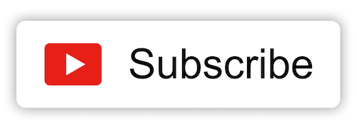

import YouTube from "../../../src/components/youtube";
import NewsletterForm from "../../../src/components/newsletter";

## 🎥 Paso 1

¡[Suscríbete a mi canal de YouTube](https://youtube.com/carlosazaustre?sub_confirmation=1) para no perderte los próximos vídeos y poder seguir correctamente el curso! **[Haz click aquí para suscribirte](https://youtube.com/carlosazaustre?sub_confirmation=1)**

## 📬 Paso 2

Apúntate a mi lista de correo para no perderte nada (esto es voluntario), ofrezco contenido creado 100% por mi, nada de SPAM.

<NewsletterForm />

## 🍿 Paso 3.

Aquí abajo, tienes los vídeos del curso 👇

## 👨🏻‍💻 Curso de PROGRAMACIÓN. Aprende a programar desde cero con JavaScript.

Bienvenida/o a mi curso de PROGRAMACIÓN desde cero, totalmente gratis y en español.
En el aprenderás los conceptos básicos para aprender a programar, usando como lenguaje JavaScript.
De ésta manera te servirá a futuro si quieres dedicarte al desarrollo web,
ya que es el lenguaje que manda en el Frontend y puedes usarlo en el Backend también.

### Vídeo 1 - Qué es la Programación. Variables, condicionales, operadores, funciones...

<YouTube videoId="-rj-zxmdGHA" />

### Vídeo 2 - En proceso

[Suscríbete al canal y dale a la campanita](https://youtube.com/carlosazaustre?sub_confirmation=1) para que te avise cuando se publique..
