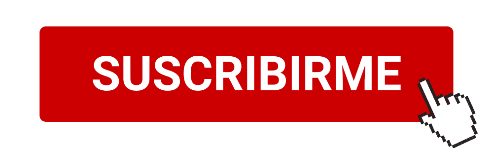

import YouTube from "../../../src/components/youtube";
import NewsletterForm from "../../../src/components/newsletter";

## Aprende a programar con JavaScript, paso a paso

Te doy la bienvenida a este curso de programación gratis, totalmente online, a través de videos y
que puedes seguir a tu ritmo, paso a paso. Esto es lo que tienes que hacer.

## 🎥 Paso 1

¡[Suscríbete a mi canal de YouTube](https://youtube.com/carlosazaustre?sub_confirmation=1) para no perderte los próximos vídeos y poder seguir correctamente el curso! **[Haz click aquí para suscribirte](https://youtube.com/carlosazaustre?sub_confirmation=1)**

## 🍿 Paso 2.

Aquí abajo, tienes los vídeos del curso 👇

### 1️⃣ - Qué es la Programación. Variables, condicionales, operadores, funciones...

<YouTube videoId="-rj-zxmdGHA" />

Bienvenida/o a mi curso de PROGRAMACIÓN desde cero, totalmente gratis y en español.
En el aprenderás los conceptos básicos para aprender a programar, usando como lenguaje JavaScript.
De ésta manera te servirá a futuro si quieres dedicarte al desarrollo web,
ya que es el lenguaje que manda en el Frontend y puedes usarlo en el Backend también.

- Qué es la programación
- Qué lenguaje de programación vamos a utilizar
- Variables
- Tipos de datos
- Operadores
- Condicionales
- Funciones
- Funciones como Clases
- Clases ECMAScript 6
- Despedida del bloque 1

### 2️⃣ - Todo lo que necesitas saber sobre bucles

<YouTube videoId="5ct-3tDiRUY" />

Todo lo que necesitas saber sobre los bucles, una excelente herramienta para
poder repetir acciones sin repetir código.

- Introducción
- Qué son los bucles y cómo funcionan
- Bucle WHILE
- Bucle DO WHILE
- Bucle FOR
- Qué es un Array
- Buenas prácticas en bucles FOR
- Bucle FOREACH para Arrays
- Cómo Recorrer propiedades de OBJETOS
- Bucle FOR...IN para Objetos
- Cierre de la parte 2

### 3️⃣ - En proceso.

[Suscríbete al canal y dale a la campanita](https://youtube.com/carlosazaustre?sub_confirmation=1) para que te avise cuando se publique..
