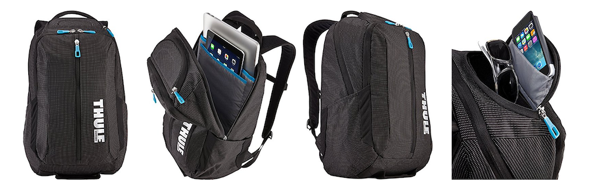
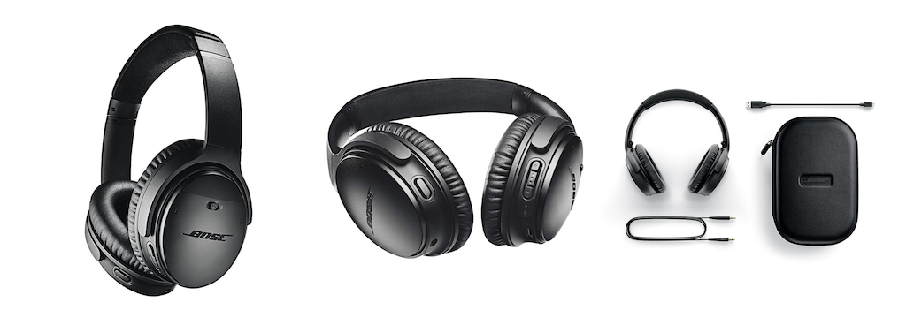
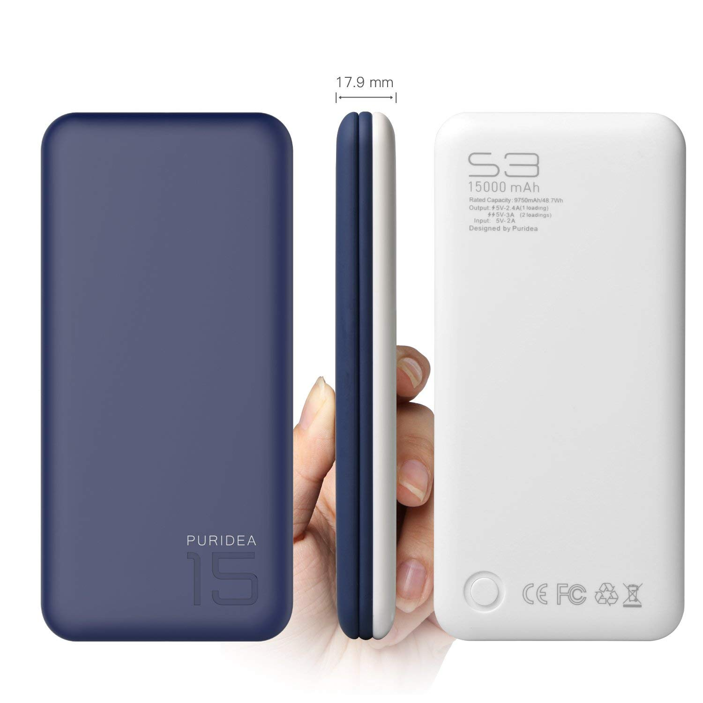
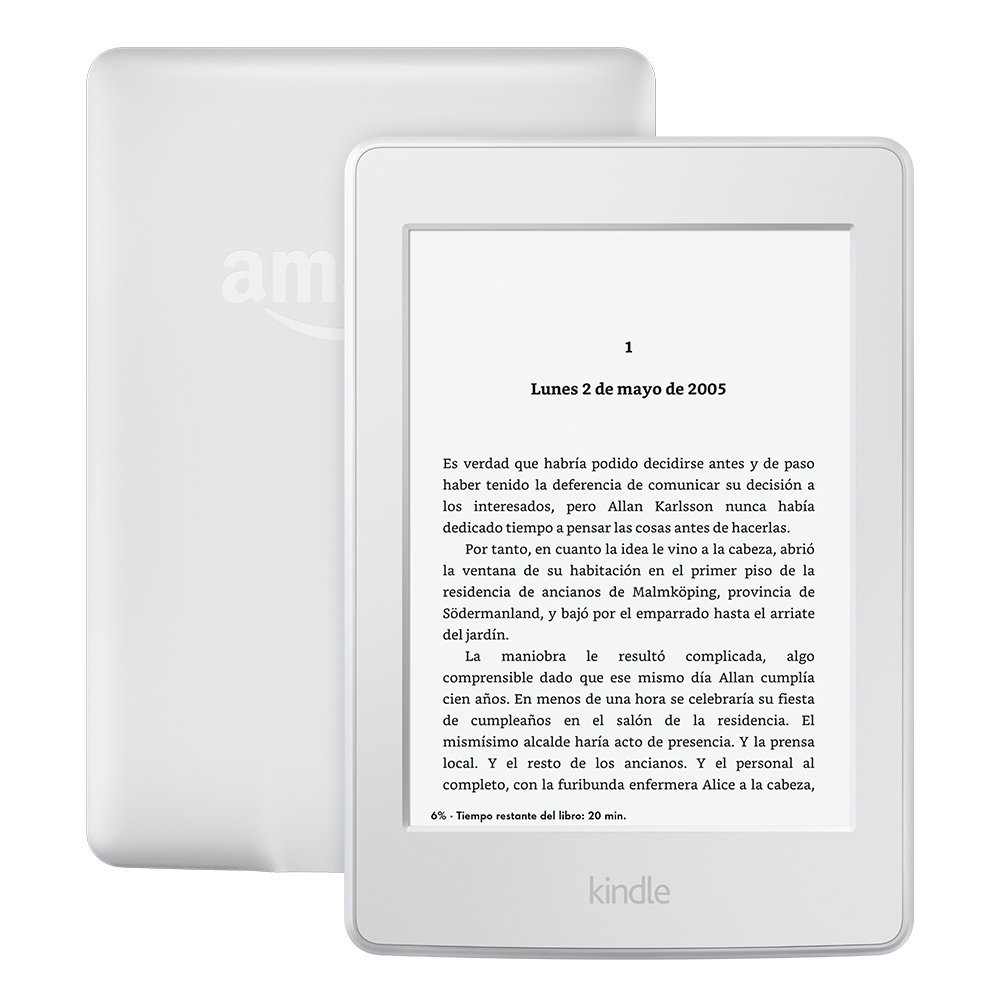
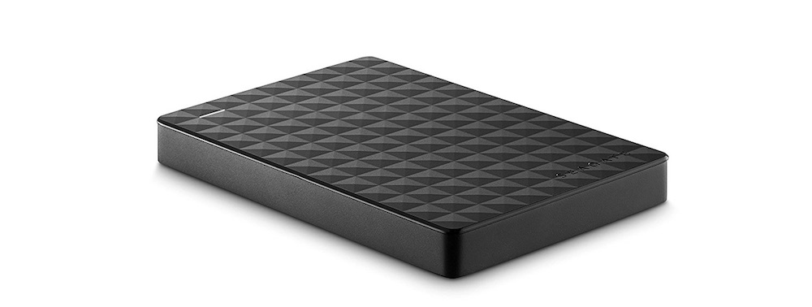
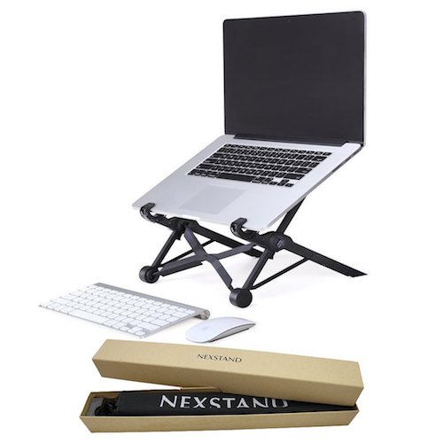
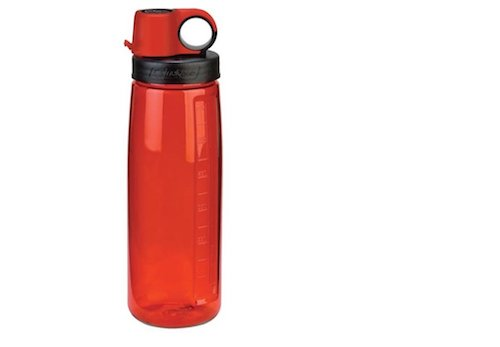
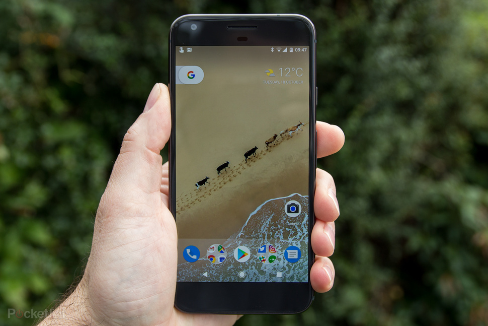
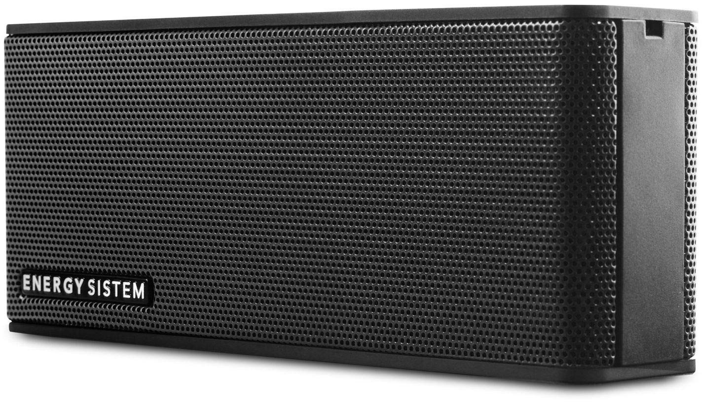

import YouTube from "../../../src/components/youtube"

Mi ordenador portáitl es mi principal herramienta de trabajo. Mis prioridades son tenerlo bien protegido y poderlo transportar de una forma apropiada.

Hace unos años hice una [review de mi mochila](/mejor-mochila-accesorios-laptop/) y lo que llevaba en ella. 

El tiempo pasa y muchas cosas las he actualizado, incluyendo la propia mochila.

A continuación te cuento que mochila llevo actualmente a mis espaldas en el día y todo lo que suelo llevar en ella.

**Navega por el contenido**
* [Mejor mochila para mi portátil](#mejormochilaparamiporttil)
* [Qué llevo en ella](#qullevoenella)
  * [Portátil](#porttil)
  * [Auriculares](#auriculares)
  * [Batería portátil](#bateraportatil)
  * [Kindle](#kindle)
  * [Disco Duro Externo](#discoduroexterno)
  * [Elevador portátil](#elevadorportatil)
  * [Teclado Externo](#tecladoexterno)
  * [Ratón](#ratn)
  * [Botella de agua](#botelladeagua)
  * [Smartphone](#smartphone)
  * [Altavoz portátil](#altavozporttil)
  * [Chromecast](#chromecast)

***

## Mejor mochila para mi portátil.

Anteriormente tenía una [Evecase que compré en Amazon](http://www.amazon.es/gp/product/B00YB8IND8/ref=as_li_ss_tl?ie=UTF8&camp=3626&creative=24822&creativeASIN=B00YB8IND8&linkCode=as2&tag=pa0f-21). 

No estaba nada mal y la verdad es que seguía como nueva cuadno la actualicé, pero encontré que se me quedaba pequeña si **quería transportar algo de equipaje cuando viajaba**.

Eso me llevó a actualizarla y adquirir una un poco más grande que me sirviera para el día a día así como para cuando estuvise de viaje sin ncesidad de tener que llevar una maleta adicional si el viaje era para algunos días.

La elegida fue una **[Thule Crossover de 25 litros](https://amzn.to/2PdXRzq)**. Algo que siempre me gusta de una mochila es que tenga diferentes apartados para poder organizar mis cosas al gusto. Ésta en concreto tiene 4 apartados:

* **Principal**, con un pequeño espacio alochado para portátil de hasta 15" (puede que quepa algo más ), otro pequño espacio para una tablet o cuaderno (Cabe hasta un iPad Pro), y un espacio donde he llegado a colocar mi equipaje para una semana.

* **Secundario**, con una rejilla y varios bolsillos donde pongo los cables, baterial portatil, etc...

* **Bolsillo *SafeZone***. Un sitio curioso y reforzado donde puedes llevar tus gafas, teléfono, etc. Lo que quieras que esté protegido ante golpes y que también puedes bloquear así como desmontar si lo deseas..

* **Bolsillo exterior**, dónde puedes colocar algo que necesites a primera mano. Para viajar por ejemplo es un buen sitio donde colocar los billetes de avion, pasaporte, etc.. o el mismo Kindle si quieres tenerlo a mano.

Adcionalmente tiene un par de bolsillos de malla en los laterales ideales para llevar un paraguas plegable o una botella para líquidos.

La **mochila es impermeable** y el material del tejido tiene un tacto agradable. Parece que no es sencillo de manchar, lo cual me encanta. Te lo digo que tengo un perro que suelta una cantidad de pelo considerable al día 🐶

Las correas para los hombros tienen uno de los mejores materiales que he probado. No se clavan si llevas mucho peso y se las ve resistentes. Además tiene un enganche a la altura del pecho que te permite ajustártela mejor.

Puedes comprar la [mochila Thule Crossover 25L en éste enlace de Amazon](https://amzn.to/2PdXRzq).

## Qué llevo en ella

### Portátil

Lo primero y principal, mi arma de trabajo 💻. 

A día de hoy tengo un **MacBook de 13" del 2013** que despues de un cambio de bateria de momento sigue tirando con sus 4GB de RAM...

* Sistema: **macOS High Sierra v10.13.6**
* Procesador: **Intel Core i5 2,4GHz**
* Memoria: **4GB 1600 MHz DDR3**
* T.Gráfica: **Intel Iris 1536 MB**
* Almacenamiento: **128 GB SSD**

Además tiene 2 conectores USB, 2 conectores Thunderbolt 2, salida para auriculares, salida HDMI y slot para leer tarjetas SD de memoria. Nada de USB-C.

>Debajo de todas esas pegatinas, hay un portátil

Los nuevos no los he probado para saber si son mejores o peores. Yo por ahora sigo contento porque de todos los portátiles que he tenido (Un *Toshiba*, un *Sony Vaio*, y el *Macbook*) éste es el que menos guerra me ha dado. 

Únicamente tuve que cambiar la batería al cabo de 4 años, pero posiblemente por mi mal uso, y el [cristal de la pantalla que salió defectuoso y Apple me lo cambió sin costo](https://www.google.es/search?biw=1071&bih=680&tbm=isch&sa=1&ei=UZt1W-LNJKWCgAaP7JSYDA&q=macbook+staingate&oq=macbook+staingate&gs_l=img.3..0j0i30k1j0i8i30k1l6j0i24k1l2.13340.14441.0.14615.9.8.0.0.0.0.188.693.0j5.5.0....0...1c.1.64.img..4.5.693....0.ZYNA6h59wYk) (De hecho ha vuelto a pasar y no tardaré en llevarlo de nuevo a ver que me dicen)

### Auriculares

He renovado mis anteriores [Sennheiser](http://www.amazon.es/gp/product/B003LPTAYI/ref=as_li_ss_tl?ie=UTF8&camp=3626&creative=24822&creativeASIN=B003LPTAYI&linkCode=as2&tag=pa0f-21) por unos Bosé con cancelación de ruido y mas transportables que los que ya tenía.

En concreto los [Bosé QuietComfort 35 II](https://amzn.to/2BeietF).

No son ecónómicos precisamente, pero la inversión merece la pena. Son inalámbricos vía Bluetooth y tienen 3 niveles de cancelacion de ruido: Ninguno, Media y Alto. 

La verdad es que eliminan bastante el ruido de fondo y sirven muy bien para concentrarse. Muy recomendados. [Puedes adquirirlos como yo a través Amazon](https://amzn.to/2OCMcZY).

### Batería Portatil

En estos tiempos de hoy en día, llevar tu *smarthphone* cargado al 100% no significa que te vaya aguantar todo el día. 

Twitter, Instagram, Youtube, Google Maps, Hacer fotos... todo consume batería y si estás de viaje o pateando la ciudad necesitas regargar pilas (nunca mejor dicho). 

Para ello dispongo de esta [batería portatil de 15,000mAh](https://amzn.to/2OHTOKD) que me permite hasta 4 cargas de mi teléfono con una sola carga.

Eso si, llenar la bateria al completo te puede llevar toda la noche, pero la espera merece la pena. [Puedes comprarla aquí en Amazon](https://amzn.to/2OHTOKD)

### Kindle
El que tengo ahora mismo es mi 3er Kindle. Ahora tengo la [versión Paperwhite y con luz](https://amzn.to/2OHbLJA), lo que me permite tambien leer en la cama por la noche sin tener que dar la luz y molestar. 

Se nota algo de diferencia en cuanto a la resolución del texto pero a mi parecer tampoco es una diferencia abismal con la version "no retina" anterior. 

Pero lo de la luz si que está bien además de que es táctil y para introducir la contraseña del WiFi o buscar por el catálogo es mucho mejor que ir moviéndose con las flechas.

El Kindle lo utilizo mucho para libros de ficción o novelas, no para libros técnicos (Para eso prefiero una tablet o iPad que es a color y me permite pasar de página más rapidamente).

Desde que lo tengo no he vuelto a leer un libro de papel.

La lectura es muy cómoda, y la manejabilidad y portabilidad que te aporta un eReader frente a un libro gordo y pesado, no tiene precio.

[Puedes comprarlo aquí.](https://amzn.to/2OHbLJA)

### Disco Duro Externo

Otra de mis renovaciones. 

Actualmente dispongo de un **[Seagate de 2 TB](https://amzn.to/2MmCaQ8)** para almacenamiento, sobre todo de videos, fotos y copias de seguridad del Mac. 

Es bantante ligero y portatil, por lo que llevarlo en la mochila no supone peso extra. Si buscas uno te lo recomiendo. No he tenido ningún problema por el momento.

### Elevador portatil

Es uno de los mejores artículos que tengo. El **[Nexstand K2](https://amzn.to/2OH79mF)**.

Super portátil, ya que una vez plegado no ocupa prácticamente nada y es bastante regulable para que puedas ajustarlo a tu altura deseada.

Lo recomiendo mil veces. Aquí tienes una review que hice hace tiempo. 

[Puedes adquirirlo desde aqui](https://amzn.to/2OH79mF)

<YouTube videoId="gzdBxql5QY4" />

### Teclado externo

Tras tener una temporada uno de "marca blanca" que me dió buenos resultados, los últimos meses me daba bastante problemas de conexión y al final tuve que prescindir de él por el tiempo que perdía día a día reconfigurandolo.

Finalmente opté por adquirir uno [de Apple](https://amzn.to/2OCQQam) y aunque ha sido un gasto importante, ahora mismo no tengo problemas de conexión cando lo utilizo y al final no gasto tanto tiempo en ello.

Se recarga con cable, por lo que te puedes olvidar de utilizar pilas.

### Ratón

Utilizo el de mi antiguo iMac y no veo razón para cambiarlo, salvo el cambio de pilas que hay que hacer cada X tiempo

### Botella de agua

Sigo con la misma desde hace 3 años y no veo razón para cambiarla.

Tine cierre antigoteo para llevar agua cuando viajo. Es resistente, tiene 650ml de capacidad y no le da sabor ni olor al agua.

La puedes [encontrar en Amazon por 7€](https://amzn.to/2wdncAU).

Aunque también utilizo las que de vez en cuando consigo de Swag en conferecnias y eventos como el Google I/O, Campus Madrid o WomenTechmakers.

### Smartphone

Mi teléfono actual es un **[Google Pixel XL](https://amzn.to/2vQa1qm)**. Estoy contento con el y de momento no tengo previsión de actualizarlo. Soporta Android Pie (9) y la cámara es una maravilla.

Despues de utilizar ambos sistemas operativos, prefiero Android a iOS. Utilizo mucho los servicios de GSuite (Gmail, Calendar, etc...) y su integración con Android es mucho mejor a mi parecer

Ahora mismo, existiendo el Pixel 2 y la inmminente llegada del Pixel 3 [lo puedes encontrar en Amazon por 350€](https://amzn.to/2vQa1qm)

### Altavoz portátil

Desde que tengo el Google Home lo utilizo menos en casa, pero cuando estoy fuera sigue siendo una gozada. Super económico y una fantástica relación calidad/precio.

El que tengo en concreto es un **Energy System Music Box** y lo puedes [adquirir aquí por menos de 20€](https://amzn.to/2KUHOmY)

### Chromecast

A mi parecer uno de los mejores inventos del siglo. Lo utilizo tanto en casa como cuando viajamos varias semanas por vacaciones o demás. 

Como usuario activo que soy de servicios como Netflix, HBO y Youtube, poder ver los vídeos fácilmente en el televisor sin necesidad de cables me parece una maravilla. 

Cuando tenía 15 años montaba unos *ziscos* en casa con cables desde la torre de mi PC en la habitación, a la entrada RGB del televisión del salón para poder ver DivX... 

Le regalé uno a mis padres y no se lo creían :D

[Puedes adquirirlo en la tienda de Google](https://store.google.com/product/chromecast_2015)

***

Y esto es básicamente lo que suelo llevar en mi mochila. sobre todo cuando viajo y llevo prácticamente todo.

¿Tienes algún gadget favorito? Comparte en los comentarios tus preferencias y recomendaciones. 

