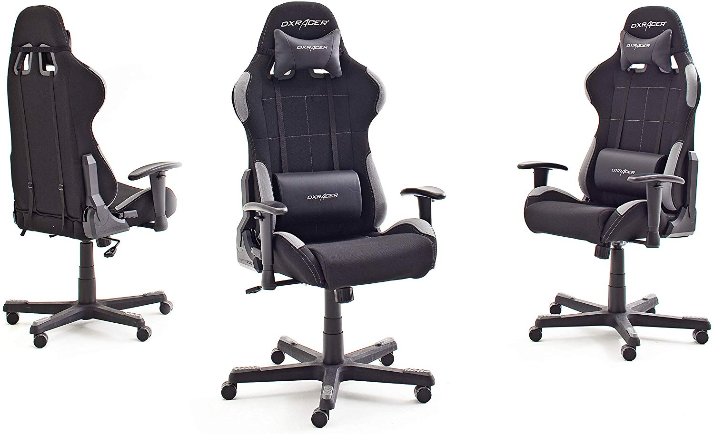
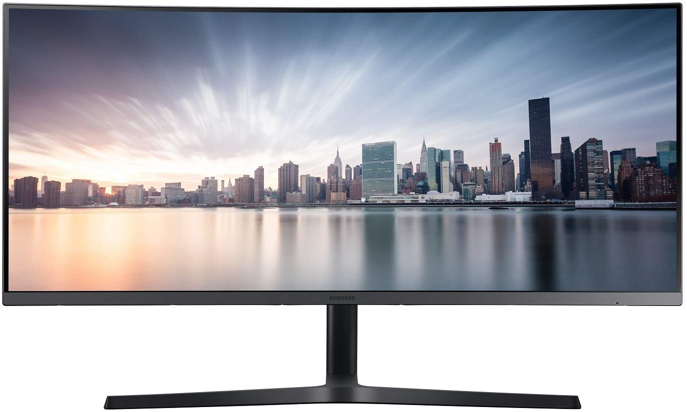
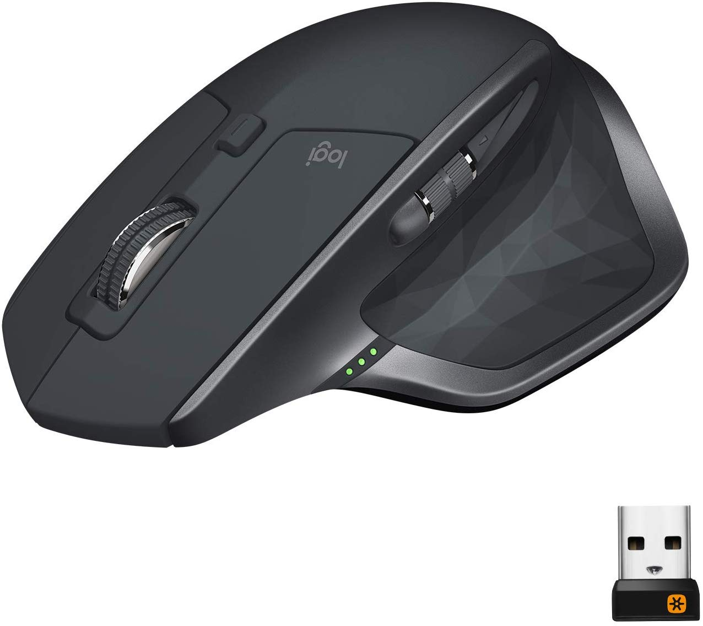
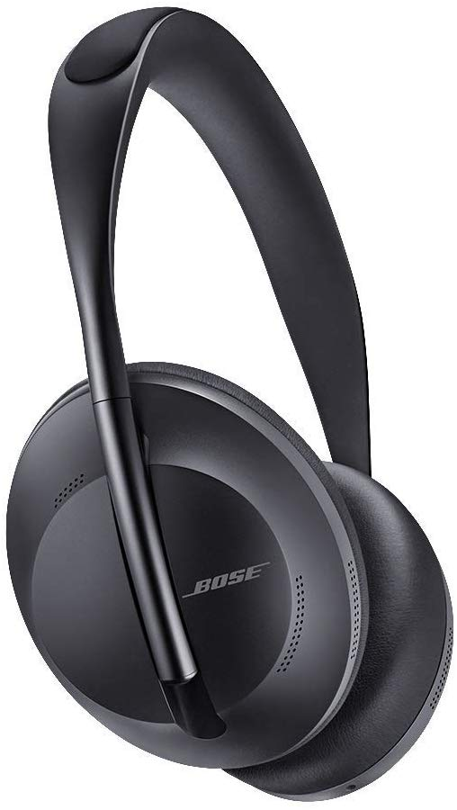
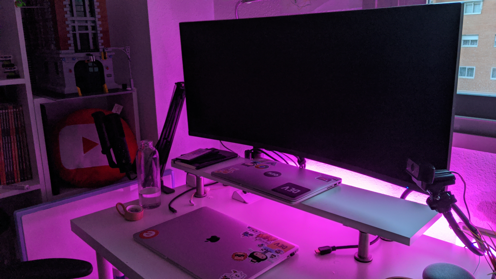

Con motivo de la reciente pandemia global en torno al Coronavirus (o Covid-19), se ha impuesto el teletrabajo, o **trabajo desde casa** para muchas personas, sobre todo si su trabajo se puede desarrollar a través de internet.

Teletrabajar o trabajar en remoto no es sencillo, requiere tiempo para adaptarse, implementar rutinas y tener un buen ambiente y zona de trabajo.

Para mi no es algo nuevo. En Eventbrite, mi actual empresa, disponemos de varios días a la semana que podemos trabajar desde casa. En IBM Research, mi anterior puesto, todo el equipo era distribuido y trabajábamos de forma remota. Y cuando estuve en Google, no había mucho teletrabajo, pero el equipo si era distribuido entre Italia, Alemania, República Checa, Suiza, USA, etc...

En este post te voy a compartir mi **zona de trabajo** con los dispositivos que utilizo en mi día a día trabajando desde casa.

## Hardware: Dispositivos y Gadgets

### Portátil
Actualmente tengo dos portátiles, el personal que ya tiene más de 6 años y algún día tocará renovar, y el del trabajo que lo proporciona la empresa:

- **Personal**: [Macbook Pro 13"](https://amzn.to/2wcaR3U) (Late 2013) Core i5 a 2.4GHz, dual-core, 4GB RAM DDR3
- **Empresa**: [Macbook Pro 15"](https://amzn.to/3d04NfF) (2018) Core i7 a 2.2GHz, 6-core 16GB RAM DDR4

En el personal es donde desarrollo todo lo relacionado con éste blog, los videos, *Open Source*, etc... El del trabajo se queda para las cosas del trabajo. Evidentemente 🙂

Mucha gente me pregunta si Mac es recomendable para desarollo. Cualquier portátil es bueno para desarrollo web, es cierto que los equipos de Apple son más caros que la media, pero también son más resistentes y duran bastante tiempo como el primer día.

Por mis manos han pasado un Toshiba Satellite, un Sony Vaio y mi Macbook Pro. Los primeros no me duraron más de un año. El de Apple lleva 6 años y salvo que 4GB de RAM ya no son suficientes en 2020, por lo demás va perfecto. Llevo trabajando con Mac desde 2010, con un iMac y despues con los portátiles, y me va a ser dificil cambiar.

Por cierto, te recomiendo [éstas toallitas](https://amzn.to/2WeF5Op) para que las teclas no se queden marcadas en la pantalla. Cuestan muy poco y alargan la vida del *display*.

### Silla
El elemento primordial del trabajo en casa. Si vas a pasar muchas horas sentado, lo mejor es que te hagas con una buena silla. Que te sea cómoda, que no te dañe la espalda, etc..

Esto es un mundo, desde sillas que valen 1,000€ hasta las de IKEA que puedes encontrar por 80€. Yo opté por adquirir una de *Gamer* aunque jugar juego poco, pero me resulta cómoda para apoyar la cabeza, recoge los riñones,... y el precio no es excesivamente caro.

Esta fue mi elección: [DX Racer 5 Robas Lund](https://amzn.to/2QfjMbB). De momento estoy muy contento con ella. Si buscas una silla cómoda e invertir dinero en ella, te la recomiendo.

### Monitor
Tener un monitor externo siempre es una buena inversión. Si tienes que tener muchas ventanas y aplicaciones abiertas, al final la pantalla del portátil se te queda pequeña.

Anteriormente usaba un montitor FullHD de 24", pero con el tiempo decidí invertir en un UltraWide. Dudé entre un monitor 4K grande u optar por un UltraWide 2K. Finalmente me decanté por el [UltraWide QHD de 3440x1440px de resolucíon de Samsung, de 34"](https://amzn.to/2WdFPn2), que además tiene conexión USB-C. Esto me permite que con un sólo cable pueda tener el portatil con batería y compartir pantalla con el monitor.

Si te gusta, lo puedes conseguir, como yo en Amazon, [desde aquí](https://amzn.to/2WdFPn2).

#### Brazo de monitor.
El monitor viene con pata y no está nada mal. Si prefieres tener mayor movilidad para la pantalla, yo compré [éste brazo](https://amzn.to/33oSd55) cuya relación calidad/precio no está nada mal. Los hay mejores y más caros, pero este aguanta el peso de las 34" y estoy muy contento con él.

Lo puedes conseguir desde Amazón [aquí](https://amzn.to/33oSd55)

#### Hub USB
El monitor tiene una entrada USB que utilizo para conectar [éste Hub](https://amzn.to/2U7tUEL), de ésta manera, como el monitor queda conectado al portatil por USB-C, puede conectar de manera muy rápida el micrófono y la webcam sin necesidad de conectar individualmente al portatil y los consiguientes adaptadores.

### Ratón o *Mouse*
Como ratón, he usado muchos años el de Apple, pero en el último año empecé a tener algunas molestias en la muñeca e invertí en [el *mouse* MX Master 2S de Logitech](https://amzn.to/3aVQ6It). Muy ergónomico y cómodo. Funciona con Bluetooth y es perfectamente compatible con los Macbook de Apple.

Además, compré [ésta almohadilla de gel](https://amzn.to/2QgUDgY) que me descarga bastante la muñeca. Te la recomiendo si haces un uso intensivo del ratón. Tu tunel carpiano te lo agradecerá. 👌

### Auriculares
Unos buenos auriculares son una buena inversión. Particularmente me gustan los de diadema y con cancelación de ruido. El sonido se escucha mejor y si necesitas un poco de concentración y aislarte del ruido externo.

Los que tengo actualmente son los [Bose 700](https://amzn.to/2xG5f2t). No son económicos precisamente, pero si aprecias una buena cancelación de ruido y una buena calidad de sonido, te los recomiendo. Si no, siempre puedes probar la [versión anterior](https://amzn.to/2x1z6Sp) que ahora está [rebajada de precio](https://amzn.to/2x1z6Sp) y que también he utilizado.

Como detalle, son recargables con USB-C, y una batería completa dura 14 horas. Para subir el volumen y pasar de canción, lo puedes hacer con un simple gesto en el auricular derecho. Parece una tontería, pero te acostumbras y luego no sabes hacerlo de otra manera 😅

Adicionalmente adqurí una [percha para sujetarlos](https://amzn.to/39TRZp8) debajo de la mesa cuando no los estoy utilizando.

### Webcam
Para videoconferencias o grabar videos, es recomendable tener una buena webcam. Las que traen integradas los Macbook suelen estar bien, y son suficientes, pero te limitan a donde tengas el *laptop* colocado.

En mi caso, tengo una [Logitech c920](https://amzn.to/2U8392L), Graba a 1080HD y si la utilizas para *livecoding* o Videoconferencias por Hangouts, Meet, Skype, Zoom, etc.. te sirve de sobra y está muy bien de precio. [Éste directo](https://www.youtube.com/watch?v=YF0_UuckZOg) que grabé en inicio desde Twitch, está grabado con ella.

Adicionalmente tengo el [siguiente soporte para poder colocar la cámara](https://amzn.to/2vnxa6q) en el lugar que estime oportuno y puedo jugar con el ángulo y la altura.

### Micrófono
Si vas a grabar videos, o hacer directos, y no puedes invertir mucho, invierte antes en un buen micrófono que en una cámara. Un buen sonido se agradece más que una buena calidad de imagen.

El micrófono que adquirí fue el [RODE NT](https://amzn.to/2QhH00Y) que se conecta por USB, eso me permite conectarlo directamente al ordenador sin necesidad de una consola, conectores especiales, etc...

Si te interesa, lo compré desde [aquí](https://amzn.to/2QhH00Y).

Para utilizar de una manera más cómoda el micrófono en el escritorio, adquirí un brazo plegable y un adaptador. De esta manera puedo tener el micro cerca de la boca, para mejor sonido, y así tener espacio para escribir y usar el ratón

- **Brazo** 
[Neewer - Soporte de Brazo de Tijera Ajustable para Micrófono,](https://amzn.to/33i2Iav)

- **Soporte**
[Rode Soporte para micrófono NT de USB](https://amzn.to/2wcqMiG)

## Bola Extra: Luz LED!
Si quieres darle un toque de luz y color a tu cueva, una buena manera es con un [rollo de luces LED de colores](https://amzn.to/2x00f8i). Hay muchas, de todo tipo y precio. Yo tengo [estas](https://amzn.to/2x00f8i), que se controlan con un mando.

El resultado es este. ¿Mola o no? 😎

Y esto es todo. ¿Qué es lo que más valoras de tu espacio de trabajo? Déjalo en los comentarios 🙂
