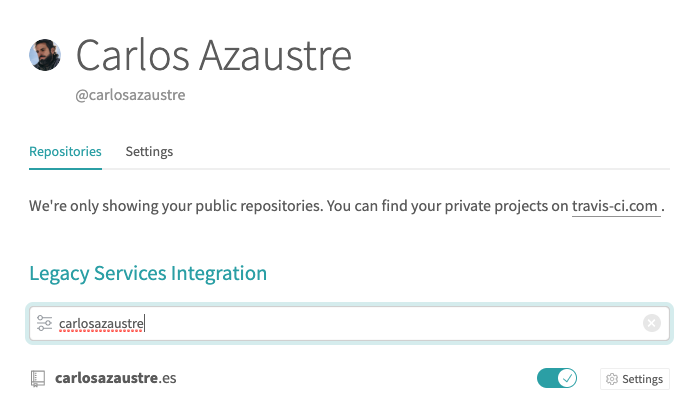

Integración Continua o *Continuous Integration (CI)* y el Despliegue Continuo o *Continuous Deployment* son dos términos que suelen ser mencionados juntos. Se refiere a una serie de tareas repetitivas como son testing, building y desplegar a producción una aplicación/web/software.

Por qué esto es importante. Imagina que tienes el código de tu app o librería *open source* en Github, la gente la usa, descarga, prueba, etc... y en algún momento alguien hace un *fork* y envía una *pull request* para añadir una nueva funcionalidad, corregir algún bug, etc... De primeras, hacer esto manual solo te lleva un poco de tiempo, pero a la larga vas a querer automatizar esto, para centrarte en tu código y delegar las tareas que puedan ser "programadas".

## Cómo funciona
### Integración Continua (CI)
Este proceso sirve para cuando un determinado software está desarrollado por varias personas y queremos automatizar su integración siguiendo el siguiente procedimiento:

1 - Subimos nuestros cambios en una rama a Github
2 - Un proceso se dispara
3 - La rama es descargada, se construye el software, y se corren los tests.
4 - El resultado se envía a dónde decidamos.

Si los test son OK, esto significa que el código puede ser *mergeado* de forma segura.

### Despliegue Continuo (CD)
Este proceso se utiliza mayormente cuando mergeamos una rama a máster:

1 - Se corren los test (idealmente de tipo E2E y más exahustivos que los que se hacen en CI)
2 - Se construye y dependiendo del tipo (app, librería, etc...) se hará una cosa u otra.
3 - Se despliega a un entorno de producción o pre-producción (*staging*, QA,...)

## Cómo configurar este proceso
Hay varias herramientas y *SaaS* que te permiten configurar un entorno de integración y despliegue contínuo. En este tutorial te voy a enseñar a configurarlo con Github y [Travis CI](https://travis-ci.org)


### Repositorio
Lo primero que necesitas es tener to código en un repositorio. Si tu proyecto es *open source*, puedes usar [Github](https://github.com) y dejarlo libre sin costo, y eso te permite usar la versión *Open* de Travis, para repositorios públicos. 

### Conectar Travis CI a tu repositorio
Una vez tengas tu repo creado, dirígete a [Travis-CI](https://travis-ci.org) e inicia sesión con tu cuenta de Github, esto permite a Travis ver tu lista de repos.
Busca el que quieres configurar y activalo con el switch a verde y despues clicka en *settings*.



En las *settings* te recomiendo que actives las opciones *Build pushed branches* y *Build pushed pull requests* para que Travis se ejecute en las PR que generes o te envíe y tambien cuando éstas sean aceptadas y mergeadas a master.

### Fichero de configuración
Aquí es donde entra la magia. Con un simple fichero que llamaremos `.travis.yml` y alojaremos en la raiz de nuestro proyecto, vamos a decirle a Travis lo que vamos a hacer. Al principio es un poco lioso, pero voy a explicarte paso a paso como hacerlo:

Veamos un ejemplo muy simple:

```yaml
language: node_js
node_js: "12"
script: 
  - "npm run lint"
  - "npm test"
  - "npm run build"
```

¿Qué estamos diciendo aquí?

- `language`: Si trabajamos con Javascript, lo más común es decirle que es `node_js` y así Travis crea una *maquina virtual* preparada para correr Node.js
- `node_js`: Cómo estamos usando Node/Javascript, tenemos que indicar que versión o versiones nos interesa que se pruebe nuestro software. En este caso le decimos que lo pruebe en `Node.js v12`
- `script`: Aquí pondremos la series de comandos que queramos que se ejecuten en el entorno que crea Travis. como ejemplo he puesto un `npm run lint` que corra ESLint por ejemplo, `npm test` para que ejecute una bateria de tests que tengamos preparados, y por último `npm run build` que contruiría la versión de producción de nuestra app/librería o software en general.

Si alguno de estos scripts fallase, Travis abortaría el proceso. Sólo sera OK si todos los scripts no reportan ningún fallo.

### El proceso de integración continua.


